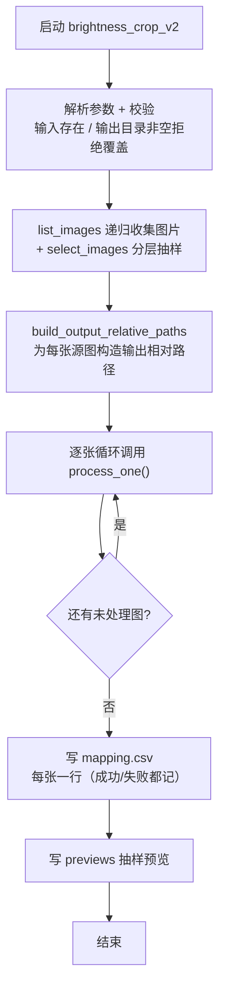
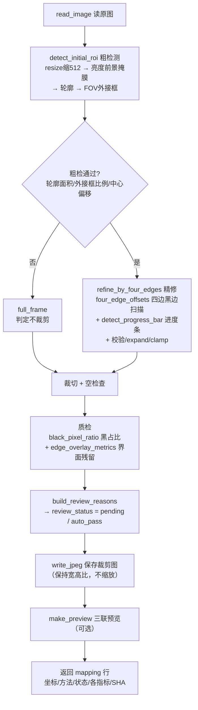

# brightness_crop_v2.py 流程图

> 用途：代码 review / 讲解用。分两张图：**整批处理流程**（main）与**单张裁剪流程**（process_one）。
> 核心思路：**先粗检（亮度轮廓找 FOV）→ 再精修（四边黑边扫描）→ 质检留痕**。

## 1. 整批处理流程（main）

## 2. 单张裁剪流程（process_one）

## 3. 关键设计点

- **粗检 → 精修 两级**：先亮度轮廓粗定位 FOV，再四边扫描裁黑边——避免单层误判；
- **full_frame 兜底**：粗检不合格或内容填满时判定不裁剪（防切到 FOV 圆）；
- **进度条感知**：检测到底部视频进度条时在栏顶截断，不把工具栏裁回；
- **只读不覆盖**：原图只读、输出独立目录、非空拒绝覆盖；
- **失败不中断**：单张异常记 `error` 行，批量继续；
- **坐标留痕**：`crop_x1..y2`、trim 量、SHA 全进 mapping，供后续 bbox 追溯。

## 4. 输出文件一览

| 文件 | 内容 |
| --- | --- |
| `crops/` | 裁剪后图像（保持宽高比、原分辨率） |
| `previews/` | 原图+裁剪框+结果 三联预览（抽样） |
| `mapping.csv` | 每张一行：坐标、是否 full_frame、进度条标志、trim 量、黑占比、界面残留、review_status、SHA |
